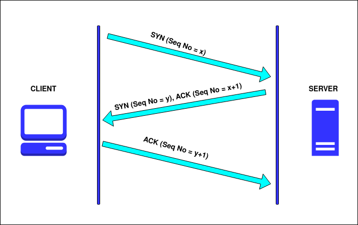

# TCP/IP Network Attack with SYN Packets



TCP Three-Way Handshake
<br/>
## Contents
- [Overview](#overview)
- [Usage](#usage)
- [Contribution](#contribution)
- [License](#license)
- [Contact](#contact)

## Overview
[](https://opensource.org/licenses/MIT)


This attack is a TCP SYN flooding attack, which is a form of Denial-of-Service attack.
It works by exploiting the three-way TCP handshake. A large number of SYN requests are sent to the target (could be a router, firewall, IPS, etc). This consumes the target's resources and prevents real clients from establishing a connection.

Every connection using the TCP protocol requires the three-way handshake, so this attack can be hard to prevent or avoid. However, don't assume this attack will work every time. In order to successfully crash the target and prevent any new clients from establishing connections, the target's resources have to be overly consumed. In other words, the smaller the target, the more likely this attack will be fully successful. 

Even if the target isn't completely crashed, running this script will at least slow down the target, since its resources are being steadily consumed.


Unlike most of my network attacks, this script does NOT require any additional hardware, like a WiFi pineapple. It should run on just about any machine with a network connection (at least that's the idea).


## Usage

**Installation:**

***Note:*** to run this script you'll need a libpcap provider, which allows you to capture, manipulate, and send raw packets. On Windows 11 you can use the free version of [NPCAP](https://npcap.com/#download). Install a libpcap provider first, then follow these steps:

- First clone the repo:
```
    git clone https://github.com/jroller33/TCP_SYN_flood_attack.git
```

- change directory into the folder you just cloned:
```
    cd <path to folder>
```

- install the dependencies: (make SURE your terminal is in the same folder as 'requirements.txt')
```
    pip install -r requirements.txt
```

- choose your target (you'll need the IP address.) For testing I use my local router.
- you'll need to modify the script and insert your target's ip address.

- run the script:
```
    python attack.py
```
or:
```
    python3 attack.py
```

- Now all you do is wait for the script to crash your target. Sometimes this can take a minute or two, depending on how resilient the target is. 

## Contribution
Contribute by forking the [repo](https://github.com/jroller33/TCP_SYN_packet_attack) and submitting a pull request!

## License
This project is licensed under the [MIT License](https://github.com/jroller33/TCP_SYN_packet_attack/LICENSE). <br/>


## Contact
[GitHub](https://github.com/jroller33)
